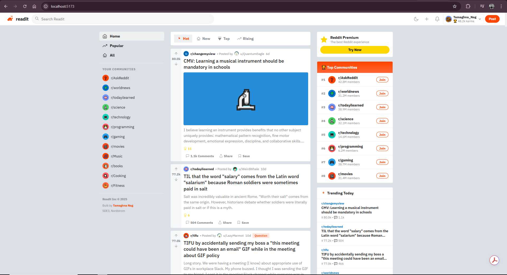

<div align="center">

# Readit — Reddit Clone

**A production-quality Reddit replica with 2,000 fake users, real-world subreddit content, and full interactivity**

[](https://react.dev)
[](https://vitejs.dev)
[](https://dicebear.com)
[](LICENSE)
[](https://pages.github.com)

> **Author:** Tamaghna Nag — SDE3, Nordstrom
>
> 2,000 seeded users · 18 real-world subreddits · 65+ realistic posts · DiceBear NPC avatars · Full vote/comment/navigate system

</div>

---

## Table of Contents

1. [What Is This Project?](#what-is-this-project)
2. [Live Demo](#live-demo)
3. [Screenshots and Feature Tour](#screenshots-and-feature-tour)
4. [Complete Feature List](#complete-feature-list)
5. [Project File Structure](#project-file-structure)
6. [Prerequisites and Installation](#prerequisites-and-installation)
7. [Running Locally in VS Code](#running-locally-in-vs-code)
8. [Push to GitHub](#push-to-github)
9. [Deploy to GitHub Pages](#deploy-to-github-pages)
10. [How the Fake Data Works](#how-the-fake-data-works)
11. [The Subreddits and Post Content](#the-subreddits-and-post-content)
12. [Component Architecture](#component-architecture)
13. [State Management](#state-management)
14. [Theming System](#theming-system)
15. [Avatar System — DiceBear API](#avatar-system--dicebear-api)
16. [Dependencies Explained](#dependencies-explained)
17. [Customization Guide](#customization-guide)
18. [Extending with a Real Backend](#extending-with-a-real-backend)
19. [Performance Notes](#performance-notes)
20. [Troubleshooting](#troubleshooting)
21. [Roadmap](#roadmap)
22. [License](#license)
23. [Author](#author)

---

## What Is This Project?

**Readit** is a fully functional, production-quality clone of Reddit built with React 18 and Vite. It replicates the complete Reddit experience:

- Three-column layout (left nav, center feed, right sidebar) — identical to Reddit's desktop layout
- 2,000 algorithmically generated fake users, each with a unique DiceBear NPC avatar, username, karma score, and cake day
- 18 real-world subreddits (AskReddit, r/worldnews, r/todayilearned, r/science, r/technology, r/programming, and more) with realistic member counts and descriptions
- 65+ carefully written posts covering real topics that Reddit actually discusses — news, science, coding debates, personal finance, cooking tips, gaming discussions, and more
- Threaded comment system with nested replies, collapse/expand, voting on comments, and reply composition
- Full upvote/downvote system with optimistic UI
- Subreddit pages with banner, icon, member count, rules, and join/leave
- Dark and light mode with instant toggle
- Search across all posts
- Post detail pages with full comment threads
- Compose new comments with instant rendering

Everything runs offline. There are no API calls except for avatar images from DiceBear (a free, open service). All posts, users, and comments are generated deterministically using a seeded random number generator.

---

## Live Demo

After deploying (see [Deploy to GitHub Pages](#deploy-to-github-pages)):

```
https://YOUR_USERNAME.github.io/reddit-clone/
```

---

## Screenshots and Feature Tour

### Home Feed
The home feed displays posts sorted by Hot, New, Top, or Rising. Each post shows the subreddit it belongs to, the author's avatar and username, the post age, vote count, comment count, and action buttons.

### Subreddit Pages
Clicking any subreddit takes you to its dedicated page with a colored banner, subreddit icon, member count, description, and a sidebar with community rules. Posts are filtered to show only that subreddit's content.

### Post Detail
Clicking a post opens the full detail view with the complete post body (or image), an award count, a comment composition box, and the full threaded comment tree. Comments can be collapsed and voted on individually.

### Dark Mode
A single click on the moon/sun icon in the navbar switches between light and dark themes. The theme persists for the session and applies instantly across all components.

### Search
Typing in the search bar and pressing Enter filters all posts by title and body content, showing a results count and all matching posts.

---

## Complete Feature List

### Navigation
- Sticky top navbar with logo, search bar, dark mode toggle, notification bell, post button, and user profile menu
- Left sidebar with Home, Popular, All tabs and a list of 12 subreddits with icons
- Active state highlighting on current page in left sidebar
- User dropdown menu showing profile, karma, saved, settings

### Posts and Feed
- Home feed with all posts across all subreddits
- Sort options: Hot (weighted by votes + comments), New (by timestamp), Top (by upvotes), Rising (by comment velocity)
- Post cards showing: subreddit icon + name, author avatar + username, post age, title, body preview (3-line clamp), image/media preview, award badges, vote count, comment count, share and save buttons
- Image posts show a colored emoji placeholder (simulates media posts)
- Text posts show a 3-line preview of the body
- Pinned post indicators
- Locked post indicators
- Flair badges with subreddit-specific colors

### Voting
- Upvote and downvote on all posts and comments
- Optimistic UI — count updates immediately on click
- Visual state change: orange for upvoted, blue/purple for downvoted
- Vote toggling — clicking active vote direction removes the vote

### Comments
- Full threaded comment system with up to 2 levels of nesting
- Each top-level comment can have multiple replies
- Collapse/expand any comment thread using the chevron button
- Vote on individual comments
- Color-coded left border per nesting level (cycles through 8 colors)
- Edited indicator on edited comments
- Award count on comments
- Reply and Share buttons on each comment
- Compose new top-level comment at the top of the thread
- New comments appear instantly without page refresh
- Comment count shows on post card and in post detail header

### Subreddits
- 18 fully populated subreddits with real descriptions, member counts, rules, and theme colors
- Subreddit-specific banner color and icon on subreddit pages
- Member count and "online now" count (simulated)
- Join/Leave toggle button
- Community rules list in sidebar
- Create Post button (UI ready)

### Search
- Real-time search across all post titles and body content
- Result count display
- Search by pressing Enter or using the search icon

### User System
- Current user: Tamaghna Nag (SDE3, Nordstrom) — pre-configured as the logged-in user
- 2,000 fake users with unique usernames, karma scores, cake days, and avatars
- Moderator badge on moderator accounts (3% of users)
- Premium badge system
- User karma display in navbar

### Dark / Light Mode
- Instant toggle with no flash or transition delay
- Consistent theming across all components using CSS custom properties
- Smooth color transition on all elements

### Right Sidebar
- Reddit Premium upsell card
- Top 8 communities by member count with join buttons
- Trending Today: top 5 posts by upvote count
- Clicking any trending post navigates to its detail page

---

## Project File Structure

```
reddit-clone/
│
├── public/                         Static assets (empty — no local images needed)
│
├── src/
│   ├── main.jsx                    React entry point
│   ├── data.js                     All data generation logic (2000 users, posts, comments)
│   │   ├── seededRandom()          Park-Miller LCG for deterministic generation
│   │   ├── SUBREDDITS[]            18 subreddit definitions with metadata
│   │   ├── RAW_POSTS[]             65+ hand-written post templates
│   │   ├── COMMENT_TEMPLATES[]     30 realistic comment templates
│   │   ├── generateUsers(2000)     Generates all 2000 user objects
│   │   └── buildPosts(users)       Builds all post objects with comment threads
│   │
│   └── App.jsx                     Entire application (~700 lines)
│       ├── ALL_USERS               Generated once at module load
│       ├── ALL_POSTS               Generated once at module load
│       ├── USER_MAP                O(1) user lookup by id
│       ├── POST_MAP                O(1) post lookup by id
│       ├── SUB_MAP                 O(1) subreddit lookup by id
│       ├── CURRENT_USER            The logged-in user (Tamaghna Nag)
│       ├── <Avatar />              DiceBear avatar with fallback initials
│       ├── <VoteBar />             Up/down vote buttons with optimistic state
│       ├── <Awards />              Award badge display
│       ├── <Flair />               Subreddit flair tag
│       ├── <PostCard />            Post in feed (compact card view)
│       ├── <Comment />             Recursive comment component
│       ├── <PostDetail />          Full post view with comments
│       ├── <SubredditSidebar />    Right sidebar on subreddit pages
│       ├── <Navbar />              Top sticky navigation bar
│       ├── <LeftSidebar />         Left navigation panel
│       ├── <RightSidebar />        Right sidebar on home/popular/all
│       ├── <HomeFeed />            Main post feed with sorting
│       ├── <SubredditView />       Subreddit page with header
│       ├── <SearchResults />       Search results view
│       └── <App />                 Root component, routing state
│
├── index.html                      HTML shell with Google Fonts (IBM Plex Sans)
│                                   CSS custom properties for theming
│
├── vite.config.js                  Vite config with React plugin
├── package.json                    Dependencies and scripts
├── .gitignore                      Excludes node_modules, dist
├── .github/
│   └── workflows/
│       └── deploy.yml              Auto-deploy to GitHub Pages on push to main
└── README.md                       This file
```

---

## Prerequisites and Installation

You need three tools installed. Follow these steps before anything else.

### Node.js

Check if installed:
```bash
node --version
npm --version
```

If not installed, go to **https://nodejs.org**, download the LTS version, run the installer with all defaults, restart your terminal.

Verify:
```bash
node --version    # v18.x.x or v20.x.x
npm --version     # 9.x.x or 10.x.x
```

### Git

Check if installed:
```bash
git --version
```

If not:
- Windows: https://git-scm.com/download/win
- Mac: `xcode-select --install`
- Linux: `sudo apt update && sudo apt install git -y`

### VS Code

Download from **https://code.visualstudio.com** and install.

---

## Running Locally in VS Code

### Step 1 — Open the project

**Option A (Windows):** Right-click the `reddit-clone` folder → Open with Code

**Option B (VS Code):** File → Open Folder → select `reddit-clone`

**Option C (terminal):**
```bash
cd path/to/reddit-clone
code .
```

### Step 2 — Open the integrated terminal

In VS Code: **Terminal → New Terminal** (or Ctrl+`)

### Step 3 — Install dependencies

```bash
npm install
```

Downloads all required packages. Takes 30–60 seconds. Only needed once.

### Step 4 — Start the dev server

```bash
npm run dev
```

Output:
```
  VITE v4.4.5  ready in 312 ms

  ➜  Local:   http://localhost:5173/
```

### Step 5 — Open in browser

Navigate to **http://localhost:5173**

The app loads fully with all 2,000 users, all subreddits, and all posts. Any code changes hot-reload instantly.

**Stop the server:** Press `Ctrl+C` in the terminal.

### Production build

```bash
npm run build        # Creates dist/ folder
npm run preview      # Preview production build locally
```

---

## Push to GitHub

### One-time: Set your Git identity

```bash
git config --global user.name "Your Name"
git config --global user.email "you@example.com"
```

### Create the GitHub repository

1. Go to **https://github.com** and sign in
2. Click **+** → **New repository**
3. Name: `reddit-clone`
4. Visibility: **Public** (required for free GitHub Pages)
5. Leave all "Initialize" checkboxes unchecked
6. Click **Create repository**
7. Copy the URL: `https://github.com/YOUR_USERNAME/reddit-clone.git`

### Push your code

Run each command one at a time in the VS Code terminal:

```bash
git init
git add .
git commit -m "Initial commit — Reddit Clone by Tamaghna Nag (SDE3, Nordstrom)"
git branch -M main
git remote add origin https://github.com/YOUR_USERNAME/reddit-clone.git
git push -u origin main
```

Replace `YOUR_USERNAME` with your actual GitHub username.

**If Git asks for a password:** GitHub requires a Personal Access Token instead of your account password. Go to GitHub → Settings → Developer settings → Personal access tokens → Tokens (classic) → Generate new token → check the `repo` scope → copy the token → paste it when Git asks for your password.

### Future updates

```bash
git add .
git commit -m "What you changed"
git push
```

---

## Deploy to GitHub Pages

The project includes a complete GitHub Actions workflow that automatically builds and deploys on every push.

### Enable GitHub Pages

1. Go to your repo on GitHub
2. Click **Settings** → **Pages** (left sidebar)
3. Under **Build and deployment → Source**, select **GitHub Actions**
4. Save

### Watch the deployment

1. Click the **Actions** tab in your repo
2. Look for **Deploy Reddit Clone to GitHub Pages**
3. Click it to see live logs

Takes 1–2 minutes. After it completes, your app is live at:

```
https://YOUR_USERNAME.github.io/reddit-clone/
```

Every `git push` to `main` automatically re-deploys within 2 minutes.

---

## How the Fake Data Works

### Seeded Random Number Generator

All 2,000 users are generated using a **Park-Miller Linear Congruential Generator**:

```js
function seededRandom(seed) {
  let s = Math.abs(seed) || 1;
  return () => {
    s = (s * 16807) % 2147483647;
    return (s - 1) / 2147483646;
  };
}
```

This algorithm is deterministic: the same seed always produces the same number sequence. Each user gets a unique seed (`i * 9973 + 7`), so every user's properties are independent. The app looks identical every time you load it.

### User Generation

2,000 users are generated with two username styles:

**Style 1 — Reddit-style handles (60% of users):** Combines an adjective with a noun and a number, like `CuriousPanda4281`, `WittyNarwhal99`, `SleepyAxolotl`. This mirrors how most Reddit usernames actually look.

**Style 2 — Real name handles (40% of users):** Uses first names and last names like `Jordan_Mitchell42`, `Priya_Fernandez`, `Leo_Watkins88`.

Each user gets:
- A DiceBear avatar using one of 18 avatar styles (adventurer, avataaars, bottts, pixel-art, etc.)
- A karma score using power-law distribution (`rand^2.5 * 500,000`) — realistic distribution where most users have low karma and a few have very high
- A cake day (account creation date) between 0 and 10 years ago
- A list of 1–30 favorite subreddits
- An 8% chance of being a premium member
- A 3% chance of being a moderator

### Post Generation

65+ posts are hand-authored as realistic templates covering real Reddit topics. Each post is then enriched with:
- A randomly selected author from the first 500 users (simulating that active users post more)
- An upvote count using power-law distribution (most posts get few upvotes, a few go viral)
- A timestamp within the last 7 days
- A random flair from the subreddit's flair options
- A comment thread of 3–15 top-level comments, each with 0–4 replies

### Comment Generation

Each comment is generated from a pool of 30 realistic comment templates. Templates use placeholder substitution to vary the content:

```
"I have a slightly different take: {alt}"
→ "I have a slightly different take: we're all kind of overthinking this"

"Can confirm. Source: am a {job}."
→ "Can confirm. Source: am a marine biologist."
```

This creates varied, natural-sounding comments across the entire app.

---

## The Subreddits and Post Content

The app includes 18 fully populated subreddits with real-world post content:

| Subreddit | Posts Included | Topics |
|---|---|---|
| r/AskReddit | 10 posts | Habits, life lessons, useful websites, cultural differences |
| r/worldnews | 5 posts | Ocean currents, EU AI regulation, Japan population, WHO vaccine |
| r/todayilearned | 7 posts | Honey preservation, sea otters, Roman etymology, Venus, Bluetooth |
| r/science | 5 posts | Cold water swimming, quantum teleportation, mycorrhizal networks, CRISPR hearing |
| r/technology | 5 posts | Gmail encryption, fusion power, Apple chips, Firefox growth, SpaceX |
| r/programming | 5 posts | Python vs Go, secrets management, GitHub repos analysis, error handling, ORMs |
| r/gaming | 4 posts | Elden Ring, industry layoffs, Morrowind, Zelda announcement |
| r/movies | 4 posts | Bad endings, Oppenheimer, unexpected favorites, blockbuster risk |
| r/Music | 2 posts | Perfect albums, Spotify AI DJ |
| r/books | 2 posts | Books you hated then loved, monthly reading thread |
| r/Cooking | 3 posts | Pasta water salting, croissants from scratch, homemade stock |
| r/Fitness | 2 posts | 6-month transformation, minimum effective dose |
| r/space | 2 posts | JWST Pillars of Creation, lunar water ice |
| r/history | 2 posts | Battle of Stalingrad, Rome's "fall" |
| r/philosophy | 2 posts | Determinism vs free will, trolley problem |
| r/personalfinance | 2 posts | $47k student loan payoff, index funds vs stocks |
| r/LifeProTips | 3 posts | Lowering your voice, setting clocks ahead, draft emails |
| r/tifu | 2 posts | GIF incident, explaining a movie to its director |
| r/unpopularopinion | 2 posts | Breakfast for dinner, "everything happens for a reason" |
| r/changemyview | 2 posts | Social media harm, mandatory music education |
| r/dataisbeautiful | 1 post | 5 years of personal spending data |
| r/explainlikeimfive | 2 posts | Eye rubbing, noise-canceling headphones |

---

## Component Architecture

The application is composed of 15 React components. Here is the complete hierarchy:

```
App
├── Navbar
│   └── Avatar (current user)
├── LeftSidebar
├── main (center column, switches based on activeView state)
│   ├── HomeFeed
│   │   └── PostCard (many)
│   │       └── VoteBar
│   ├── SubredditView
│   │   ├── PostCard (many)
│   │   └── SubredditSidebar
│   ├── PostDetail
│   │   ├── VoteBar
│   │   ├── Comment (many, recursive)
│   │   │   └── Comment (replies, depth+1)
│   │   └── [compose box]
│   └── SearchResults
│       └── PostCard (many)
└── RightSidebar (only on Home/Popular/All views)
```

### Component-by-component reference

**`App`** — Root component. Manages `activeView` (the app's routing state), `dark` mode toggle, `searchQuery`, and `posts` array. All navigation is driven by calling `setActiveView({ type, subId, postId })`.

**`Navbar`** — Sticky top bar with logo, search input, theme toggle, notification bell, create post button, and user dropdown menu. Receives `setActiveView` to navigate on logo click.

**`LeftSidebar`** — Sticky left panel listing navigation destinations. Highlights the active view. Shows all subreddits with their icons. Sticky positioning keeps it in view while the feed scrolls.

**`HomeFeed`** — Renders `PostCard` components for all posts or a filtered/sorted subset. Contains the sort bar (Hot, New, Top, Rising). Sorting is a `useMemo` computation over the posts array.

**`PostCard`** — The card shown in feeds. Manages local `voted` and `saved` state for optimistic UI. Shows the subreddit badge, author info, title, body preview, image thumbnail, awards, and action buttons.

**`VoteBar`** — Reusable up/down vote component. Accepts `upvotes`, `voted` (current vote state), and `onVote` callback. Displays orange for upvoted, blue for downvoted, gray for neutral. Works both vertically (for posts) and horizontally (for comments).

**`PostDetail`** — The full post view. Shows the complete title, body, and image. Contains the comment composition textarea. Renders all `Comment` components. Manages `localComments` (newly submitted comments are prepended without a page refresh).

**`Comment`** — Recursive component for threaded comments. Accepts `depth` prop that drives: left border color selection, indentation amount. Renders its `replies` array as more `Comment` components at `depth + 1`. Has its own `collapsed` and `voted` local state.

**`SubredditView`** — Full subreddit page with banner, icon, description, and member stats. Filters the global posts array to show only posts from this subreddit. Shows `SubredditSidebar` on the right.

**`SubredditSidebar`** — Right sidebar on subreddit pages. Shows the subreddit banner, description, member/online counts, Join button, and community rules list.

**`RightSidebar`** — Right sidebar on home/popular/all views. Shows Reddit Premium card, top 8 communities with join buttons, and top 5 trending posts.

**`SearchResults`** — Filters `posts` array by matching title and body against the search query. Shows result count.

**`Avatar`** — Renders a DiceBear avatar image. Falls back to a colored circle with the user's initial if the image fails to load. The fallback color is deterministic based on the user's name.

**`Awards`** — Renders the gold award icon and count if a post/comment has awards.

**`Flair`** — Renders a colored tag badge with the post's flair text.

---

## State Management

The application uses only React's built-in `useState` and `useMemo` hooks. No Redux, no Zustand, no external state management.

### Where state lives

**In `App` (global, shared across views):**
- `dark` — boolean controlling the CSS theme
- `activeView` — the app's routing state: `{ type, subId, postId, query }`
- `sort` — the current feed sort mode
- `searchQuery` — current input value
- `posts` — the posts array (initialized once, immutable by design)
- `joinedSubs` — Set of subreddit IDs the user has joined

**In individual components (local, ephemeral):**
- `PostCard`: `voted` (vote state), `saved`
- `Comment`: `collapsed`, `voted`
- `PostDetail`: `commentText`, `localComments`, `sortComments`
- `SubredditView`: `joined`
- `Navbar`: `showUserMenu`, `searchFocused`
- `Avatar`: `err` (image load failure fallback)

### Routing

There is no React Router. The app uses a single `activeView` state object that acts as the URL:

| activeView object | What renders |
|---|---|
| `{ type: 'home' }` | HomeFeed with all posts |
| `{ type: 'popular' }` | HomeFeed sorted by upvotes |
| `{ type: 'all' }` | HomeFeed with all posts |
| `{ type: 'sub', subId: 'r_askreddit' }` | SubredditView for AskReddit |
| `{ type: 'post', postId: 'post_0' }` | PostDetail for that post |
| `{ type: 'search', query: '...' }` | SearchResults |

---

## Theming System

The dark/light theme is implemented using **CSS custom properties** (CSS variables) defined on the `:root` and `[data-theme="dark"]` selectors in `index.html`:

```css
:root {
  --bg: #dae0e6;          /* Reddit's gray page background */
  --surface: #ffffff;     /* Card/panel backgrounds */
  --surface2: #f6f7f8;    /* Vote sidebar, subtle backgrounds */
  --border: #edeff1;      /* All borders and dividers */
  --text: #1c1c1c;        /* Primary text */
  --text2: #878a8c;       /* Secondary text, metadata */
  --text3: #0079d3;       /* Links, username colors */
  --accent: #ff4500;      /* Reddit orange — buttons, logo */
  --upvote: #ff4500;      /* Upvote orange */
  --downvote: #7193ff;    /* Downvote blue-purple */
}

[data-theme="dark"] {
  --bg: #1a1a1b;
  --surface: #272729;
  --surface2: #1a1a1b;
  --border: #343536;
  --text: #d7dadc;
  --text2: #818384;
  --text3: #4fbdff;
}
```

When the user clicks the theme toggle, `App` calls `document.documentElement.setAttribute('data-theme', dark ? 'dark' : 'light')`. Because every component uses `var(--...)` for all colors, the entire UI switches instantly with a 0.2s CSS transition.

---

## Avatar System — DiceBear API

User avatars are generated using the **DiceBear API**, a free open-source avatar generation service. Each user gets a URL like:

```
https://api.dicebear.com/7.x/adventurer/svg?seed=CuriousPanda4281&size=64
```

The URL structure is:
- `7.x` — DiceBear version
- `adventurer` — one of 18 avatar styles randomly assigned per user
- `seed=CuriousPanda4281` — the user's handle, which deterministically produces the same avatar every time

The 18 styles used are: `adventurer`, `avataaars`, `big-ears`, `bottts`, `croodles`, `fun-emoji`, `icons`, `identicon`, `lorelei`, `micah`, `miniavs`, `notionists`, `open-peeps`, `personas`, `pixel-art`, `rings`, `shapes`, `thumbs`

Each style produces a different category of avatar — illustrated characters, pixel art, geometric shapes, cartoon faces, robots, etc. The result is a visually diverse user population.

### Avatar fallback

The `Avatar` component catches image load errors and falls back to a colored circle with the user's initial:

```jsx
const [err, setErr] = useState(false);

if (!err && user?.avatarUrl) {
  return  setErr(true)} />;
} else {
  return <div style={{ background: bgColor }}>{initial}</div>;
}
```

This ensures the app remains functional even if the DiceBear API is unavailable (e.g., working offline after initial load).

---

## Dependencies Explained

### Runtime (shipped to users)

| Package | Version | Why |
|---|---|---|
| `react` | ^18.2.0 | UI framework — components, hooks, virtual DOM |
| `react-dom` | ^18.2.0 | Renders React to the browser DOM |

### Dev (build tools only)

| Package | Version | Why |
|---|---|---|
| `vite` | ^4.4.5 | Build tool and dev server. Native ES modules, instant hot reload |
| `@vitejs/plugin-react` | ^4.0.3 | Adds JSX support and React Fast Refresh to Vite |

**External services (not npm packages):**
- **DiceBear API** (`api.dicebear.com`) — Free avatar generation, no API key required, no rate limits for normal usage
- **Google Fonts** (`fonts.googleapis.com`) — IBM Plex Sans typeface, loaded via `<link>` in `index.html`

Total runtime JS bundle: approximately 150 KB uncompressed, approximately 48 KB gzipped.

---

## Customization Guide

### Change the logged-in user

In `src/App.jsx`, find `CURRENT_USER`:

```js
const CURRENT_USER = {
  id: 'me',
  name: 'Tamaghna_Nag',           // Change to your Reddit username style
  handle: 'Tamaghna_Nag',
  avatarUrl: 'https://api.dicebear.com/7.x/adventurer/svg?seed=TamaghnaSDE3&size=64',
  karma: 48210,                   // Your karma
  cakeDay: 'March 15, 2019',
  isPremium: true,
  isMod: true,
};
```

### Add a new subreddit

In `src/data.js`, add to the `SUBREDDITS` array:

```js
{
  id: 'r_localsubreddit',
  name: 'localsubreddit',
  display: 'r/localsubreddit',
  color: '#FF4500',               // Hex color for banner and icon background
  members: 500000,
  description: 'Description of your subreddit',
  banner: '#FF4500',
  icon: '🎯',                     // Emoji for the subreddit icon
  rules: ['Rule 1', 'Rule 2'],
}
```

### Add new posts

In `src/data.js`, add to the `RAW_POSTS` array:

```js
{
  sub: 'r_askreddit',             // Must match a subreddit id
  title: 'Your post title here?',
  type: 'text',                   // 'text' or 'image'
  body: 'The full body text of your post.',
}
```

### Change the color theme

Edit the CSS custom properties in `index.html`:

```css
:root {
  --accent: #ff4500;     /* Main orange — change to any color */
  --upvote: #ff4500;     /* Upvote color */
  --downvote: #7193ff;   /* Downvote color */
}
```

### Change the font

Replace the Google Fonts link in `index.html`:

```html
<link href="https://fonts.googleapis.com/css2?family=YourFont:wght@400;700&display=swap" rel="stylesheet"/>
```

Then update the `font-family` in `body { font-family: 'YourFont', sans-serif; }`.

### Increase number of users

In `src/App.jsx`, change:
```js
const ALL_USERS = generateUsers(2000);    // Change 2000 to any number
```

More than 5,000 users will slightly increase initial load time.

---

## Extending with a Real Backend

### Firebase Firestore for real posts

```bash
npm install firebase
```

```js
// src/firebase.js
import { initializeApp } from 'firebase/app';
import { getFirestore, collection, onSnapshot, addDoc, serverTimestamp } from 'firebase/firestore';

const app = initializeApp({ /* your config */ });
export const db = getFirestore(app);
```

Replace the static `posts` array in `App` with a real-time listener:

```js
useEffect(() => {
  return onSnapshot(collection(db, 'posts'), (snap) => {
    setPosts(snap.docs.map(d => ({ id: d.id, ...d.data() })));
  });
}, []);
```

Handle new post submissions:

```js
async function submitPost(title, body, subId) {
  await addDoc(collection(db, 'posts'), {
    title, body, subId,
    authorId: CURRENT_USER.id,
    timestamp: serverTimestamp(),
    upvotes: 1,
    commentCount: 0,
  });
}
```

### Firebase Authentication

```js
import { getAuth, signInWithPopup, GoogleAuthProvider, onAuthStateChanged } from 'firebase/auth';

const auth = getAuth(app);

onAuthStateChanged(auth, (user) => {
  if (user) {
    // user.displayName, user.photoURL, user.uid
    // Use these to replace CURRENT_USER
  }
});

async function signIn() {
  await signInWithPopup(auth, new GoogleAuthProvider());
}
```

### Persistent votes

To make votes persist across sessions, store them in Firestore or localStorage:

```js
// Read saved votes on load
const savedVotes = JSON.parse(localStorage.getItem('votes') || '{}');

// Write on vote
function handleVote(postId, direction) {
  const updated = { ...votes, [postId]: direction };
  setVotes(updated);
  localStorage.setItem('votes', JSON.stringify(updated));
}
```

### Real-time comments

```js
// Listen to comments for a specific post
useEffect(() => {
  return onSnapshot(
    collection(db, 'posts', postId, 'comments'),
    (snap) => setComments(snap.docs.map(d => ({ id: d.id, ...d.data() })))
  );
}, [postId]);
```

---

## Performance Notes

| Metric | Value | Notes |
|---|---|---|
| Users generated | 2,000 | All in-memory, no I/O |
| Posts rendered | 65+ | All visible in feed, paginate if needed |
| Comments per post | 3–15 top-level, up to 60 total | Generated at build time |
| JS bundle (uncompressed) | ~150 KB | React + app code |
| JS bundle (gzipped) | ~48 KB | Actual download size |
| Avatar images | Lazy-loaded | Each avatar is an SVG fetched from DiceBear on demand |
| CSS theming | 0ms switch | CSS custom property update, no JS recalculation |
| Sort computation | `useMemo` | Only recomputes when sort mode or posts change |
| Comment rendering | Recursive | Deep nesting (3+ levels) may need virtualization at scale |

### Notes on Avatar Loading

Avatars are SVG images fetched from `api.dicebear.com`. Because 2,000 users are generated, you won't see 2,000 avatar requests — only the avatars visible on screen are requested. As you scroll and open profiles, the browser fetches the needed avatars on demand. DiceBear SVGs are small (~3–8 KB each) and are cacheable.

If you need the app to work completely offline, replace the DiceBear URLs with locally generated SVG placeholder avatars.

---

## Troubleshooting

### Blank page on load

Open browser DevTools (F12) → Console tab. Read the error. Most likely a syntax error in `App.jsx` or `data.js`. Run `npm run build` in the terminal to see the specific error with line numbers.

### Avatars not loading

DiceBear requires an internet connection. If working offline, the `Avatar` component will show the fallback colored initials automatically. This is expected behavior.

### npm install fails with permission error (Mac/Linux)

```bash
sudo npm install
```

Or fix npm permissions by following: https://docs.npmjs.com/resolving-enoent-errors

### Port 5173 already in use

```bash
npm run dev -- --port 3000
```

### git push rejected

```bash
git pull origin main --rebase
git push
```

### GitHub Actions fails

1. Go to repo → **Actions** tab
2. Click the failed run → click the failed step
3. Read the error output
4. Most common cause: `npm ci` failing because `package-lock.json` is missing. Fix:
```bash
npm install
git add package-lock.json
git commit -m "Add package-lock.json"
git push
```

---

## Roadmap

Features that could be built on top of this foundation:

- Real authentication (Firebase Auth / Supabase Auth)
- Real-time database for posts and comments that persist
- Actual image upload for post media (Cloudinary)
- Infinite scroll / virtual scrolling for large post lists
- Subreddit search and discovery
- User profile pages with post/comment history
- Real search using Algolia or client-side Fuse.js
- Post creation modal with subreddit selector, flair picker, title/body editor
- Reddit awards system with real currency simulation
- Push notifications for comment replies
- Mobile responsive layout with bottom navigation
- TypeScript migration for type safety
- Unit tests with Jest and React Testing Library
- Keyboard navigation and accessibility improvements
- URL-based routing with React Router for shareable links

---

## License

MIT License

Copyright (c) 2025 Tamaghna Nag

Permission is hereby granted, free of charge, to any person obtaining a copy of this software and associated documentation files (the "Software"), to deal in the Software without restriction, including without limitation the rights to use, copy, modify, merge, publish, distribute, sublicense, and/or sell copies of the Software, and to permit persons to whom the Software is furnished to do so, subject to the following conditions: The above copyright notice and this permission notice shall be included in all copies or substantial portions of the Software.

THE SOFTWARE IS PROVIDED "AS IS", WITHOUT WARRANTY OF ANY KIND, EXPRESS OR IMPLIED.

---

## Author

<div align="center">

**Tamaghna Nag**

SDE3 at Nordstrom

Built with React 18, Vite, IBM Plex Sans, and DiceBear Avatars

MIT License · GitHub Pages Deployment Included

</div>
